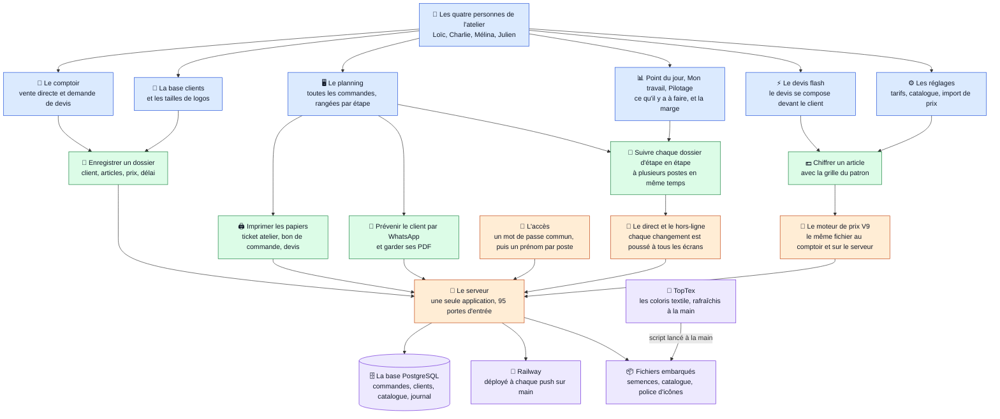
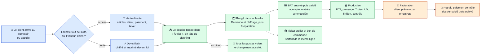

# ARCHITECTURE — Planning OLDA

Audit du **01/09/2026** sur `main` (commit `e9aef62`, PR #190 incluse).
Méthode : lecture du code et recoupements automatiques — routes du serveur ↔
appels réseau des écrans, `export` ↔ `import`, classes CSS ↔ HTML/JS, colonnes ↔
requêtes SQL, liste de précache du service worker ↔ fichiers présents. La suite
de tests a été exécutée sur ce commit : **107 fichiers, tous verts**.

> ## Ce que le nettoyage a changé depuis le constat
>
> Les parties 1 à 4 décrivent l'état **avant** nettoyage. Le premier lot du plan
> (partie 5) a été exécuté le 01/09 : voir le commit
> « le code mort part, et l'appel à l'API n'existe plus qu'une fois ».
> **Trois choses que l'audit avait mal jugées**, corrigées après vérification :
>
> 1. **`POST /api/projets` ne part pas.** Il porte le SEUL chiffrage serveur de
>    la grille tasse — le comptoir, lui, envoie un montant déjà calculé à
>    l'écran. C'est par cette route que `test/tarifs-tasse.test.js` prouve
>    qu'une tasse sort à 16, 14 et 22 €, et qu'un logo client sur l'autre face
>    vaut +6 €. On ne retire pas le seul endroit qui prouve qu'un prix est
>    juste. `catalog.json` reste pour la même raison. La ligne 12 du plan est
>    donc **annulée** : le vrai chantier n'est pas « supprimer », c'est « sortir
>    ce calcul dans un module à lui », et ça touche au chiffrage.
> 2. **Les routes qui lisent un historique qu'on écrit restent** (journal d'un
>    dossier, versions d'un PDF). Les retirer rendrait des données inaccessibles
>    sans cesser de les écrire. La ligne 11 du plan est réduite en conséquence.
> 3. **`editSelectedClient` n'était pas simplement morte** : l'écran de vente en
>    déclarait une version en haut et la redéfinissait en bas, et le bouton
>    appelle la seconde. La sonde ne voyait pas `window.<nom> =`. La déclaration
>    morte est partie, et le test qui l'épinglait suit désormais la version
>    vivante — il gardait une fausse sécurité.
>
> **Les migrations de retrait restent utiles** : sur la base de production,
> `statuses`, `production_sectors` et la colonne `requests.status` existent
> encore. La ligne 16 du plan attend qu'elles aient disparu.

| Repère | Valeur |
|---|---|
| Lignes de code (hors `node_modules`, `archives/`, `docs/`) | ≈ 55 000 |
| `server.js` / `db.js` / `public/app.js` | 5 522 / 3 741 / 8 118 lignes |
| Routes HTTP déclarées dans `server.js` | 95 |
| Tables dans `schema.sql` | 11 |
| Gardes de migration (`app_meta`) dans `db.js` | 37 |
| Dépendances npm | 4 (`express`, `compression`, `pg`, `pg-mem`), toutes importées |
| Fichiers de test | 107 (+ 3 socles, 1 fixture) |

---

## PARTIE 1 — Schéma pyramide

**Légende**

- 🟦 **Niveau 1 — Les gens et leurs écrans.** Quatre personnes, PC uniquement, dans une seule page (`public/index.html`) qui affiche une vue à la fois, plus les deux écrans du comptoir posés dans un cadre.
  Tout ce qui est bleu se trouve dans `public/` ; chaque écran a son fichier JS et sa feuille CSS, chargés au premier passage.
- 🟩 **Niveau 2 — Ce que l'outil fait.** Enregistrer, chiffrer, suivre, imprimer, prévenir : cinq verbes, et chaque écran n'en porte qu'un ou deux.
  La règle du dépôt : les chiffres et les règles métier sont intouchables, l'habillage est à Charlie.
- 🟧 **Niveau 3 — Le serveur.** Un seul processus Node (`server.js` + `db.js`), pas de build, qui sert les fichiers tels quels et répond en JSON.
  Le direct passe par un flux SSE ; le hors-ligne par un service worker qui ne sert son cache qu'en repli.
- 🟪 **Niveau 4 — Les données.** Une base PostgreSQL sur Railway (en local : `pg-mem`, en mémoire), quatre fichiers-semences JSON qui remplissent une base neuve, et un seul tiers : TopTex, appelé par un script manuel, jamais par un poste.
  Aucune police, icône ou bibliothèque ne vient d'un autre domaine.

---

## PARTIE 2 — Parcours utilisateur

Les cinq familles du planning et leurs sous-étapes sont déclarées une seule fois dans `db.js` (`FAMILIES`, `SUB_STAGES`) : « À trier », « Demande & chiffrage », « Préparation du projet », « Production », « Facturation », « Paiement », plus la famille à part « Fiverr ».

---

## PARTIE 3 — État des lieux

Statuts : **Actif** (utilisé par un écran ou un outil), **Mort** (aucun écran ne l'appelle ; les tests seuls le font parfois), **Doublon** (deux façons de faire la même chose). **Aucune fonctionnalité cassée n'a été trouvée** : pas d'import manquant, pas de fichier absent, pas de route appelée par un écran qui n'existerait pas côté serveur, tests verts.

| Nom | Ce que ça fait | Statut | Fichiers concernés |
|---|---|---|---|
| Planning (tableau et cartes) | Liste des dossiers par famille et sous-étape ; glisser-déposer, ordre manuel, colonnes au choix, recherche | Actif | `public/app.js`, `public/styles.css`, `public/index.html` |
| Fiche atelier (tiroir d'une ligne) | Tout le dossier modifiable, l'argent sur les rails | Actif | `public/fiche-atelier.js`, `public/fiche-atelier.css`, `public/ligne-faits.js` |
| Recherche globale (palette) | Commandes et clients en une frappe | Actif | `public/app.js`, `server.js:2744` |
| Point du jour | Console d'atelier : ce qu'il faut faire maintenant | Actif | `public/dashboard.js`, `public/dashboard.css`, `public/priority.js` |
| Mon travail | Ce que la personne au poste doit faire ; lit et coche les tâches | Actif (derrière l'interrupteur `comptes`) | `public/montravail.js`, `server.js:1809`, `server.js:2320` |
| Pilotage | Marge par dossier, pour la Direction | Actif (derrière l'interrupteur `marges`) | `public/pilotage.js`, `server.js:2147` |
| Fiverr et À commander | Deux raccourcis d'étape dans la barre, plus la calculette de marge Fiverr | Actif | `public/index.html:186-190`, `public/app.js:141-142`, `public/app.js:319-335` |
| Base clients | Fiches, notes, secteurs, numéro `CLI-PRO-0007` attribué par le serveur | Actif | `public/clients.js`, `public/clients.css`, `server.js:3453-3651` |
| Tailles des logos | Le tableau de l'atelier par famille | Actif | `public/tailles-logos.js`, `public/tailles-logos.css`, `tailles-logo-seed.json` |
| Réglages | Tarifs tasse, suppléments express, transport, WhatsApp, textile, entreprise, machines, pilotes, catalogue + import CSV, interrupteurs, corbeille, modèles de tâches, marges | Actif | `public/reglages.js`, `public/reglages.css`, `catalogue-csv.js` |
| Devis flash | Le devis se compose devant le client et part au planning | Actif | `public/devis-flash.js`, `public/devis-flash.css`, `public/devis.js`, `server.js:5152` |
| Nouveau projet → Vente directe / Demande de devis | Les deux écrans du patron dans un cadre, reliés au CRM par `pont.js` | Actif | `public/nouveau-projet.js`, `public/projet.css`, `public/comptoir/*` |
| Catalogue produits du comptoir | Menu produit lu en base (repli `localStorage`), semé depuis un JSON | Actif | `public/comptoir/catalogue.js`, `server.js:1062`, `db.js` (`semerCatalogueProduits`), `catalogue-produits-seed.json` |
| Catalogue textile et moteur V9 | Références, coloris, moteur de prix ; le même fichier est chargé côté serveur dans un bac à sable | Actif | `public/comptoir/textile-catalog.js`, `chiffrage.js:39-58`, `catalogue-textile-seed.json` |
| Coloris TopTex | Script manuel qui fige les coloris dans le catalogue textile | Actif (outil hors ligne) | `toptex.js`, `scripts/refresh-toptex-couleurs.js` |
| Les quatre papiers | Ticket atelier, bon de commande, devis A4, facture A4, sur un socle commun | Actif | `public/ticket.js`, `public/bureau.js`, `public/devis.js`, `public/facture.js`, `public/papier.js` |
| Vente flash et facture | La facture se compose devant le client, puis s'émet : numéro sans trou (`FA-2026-0001`), document archivé tel qu'imprimé, aucune route d'écriture après création | Actif | `public/vente-flash.js`, `public/facture.js`, `server.js` (`POST /api/factures`), table `invoices` |
| Avoir | La seule façon de corriger une facture : son propre compteur (`AV-2026-0001`), l'arithmétique de la facture corrigée, total ou partiel, jamais plus que ce qui reste à rendre. S'établit depuis la facture rouverte | Actif | `server.js` (`POST /api/avoirs`), table `credit_notes`, `public/facture.js`, `public/app.js` (`formulaireAvoir`) |
| Journal des factures | Les deux séries par année, avoirs en négatif, et export CSV pour le comptable, depuis Réglages | Actif | `server.js` (`GET /api/factures`, `GET /api/factures.csv`), `public/reglages.js` (`renderJournal`) |
| Mentions de régime | La phrase qui justifie une exonération, par régime. Réglage, figé à l'émission ; vide = rien ne s'imprime — aucune citation d'article n'est inventée | Actif | `db.js` (`getMentionsRegime`), `server.js` (`/api/settings/mentions-regime`), `public/reglages.js` |
| Identité de l'atelier | Ce qui signe la facture, le devis et le bon de commande. Réglage (`app_meta.entreprise`), semé au démarrage s'il est vide — une facture sans SIRET n'est pas opposable | Actif | `db.js` (`semerIdentiteAtelier`), `public/reglages.js`, `public/papier.js` (`maisonPapier`) |
| Pièces jointes PDF (devis, BAT, facture) | Dépôt, ouverture, suppression ; chaque remplacement est archivé | Actif | `server.js:3179-3322`, `public/app.js:2871` |
| Historique des versions PDF | Liste et lecture des anciennes versions | **Mort** (écrit à chaque remplacement, jamais lu par un écran) | `server.js:3277`, `server.js:3288`, table `attachment_versions` |
| WhatsApp « commande prête » | Lien `wa.me` + message réglable | Actif | `public/whatsapp.js`, `server.js:1180` |
| Temps réel (SSE) | Chaque écriture est diffusée aux postes | Actif | `server.js:894`, `public/app.js:6552` |
| Mise à jour des postes | Bulle « mise à jour disponible » | Actif | `public/maj.js`, `server.js:519` |
| Service worker | Coquille hors ligne, réseau prioritaire | Actif (48 entrées de précache, toutes présentes) | `public/sw.js` |
| Poste et session | Prénom par appareil ; comptes nominatifs et rôles derrière `comptes` | Actif | `public/poste.js`, `public/session.js`, `server.js:560-870` |
| Journal des modifications | Qui a changé quoi ; alimente « terminé aujourd'hui » de Mon travail | Actif pour l'écriture ; la route de lecture par dossier est **Morte** | `db.js` (`logRequestChanges`), `server.js:2783` |
| Archivage et corbeille | Supprimer = archiver ; restauration depuis Réglages | Actif | `server.js:3129`, `server.js:3151`, `server.js:1747`, `public/reglages.js:618` |
| Copie de commande, envoi Fiverr | Duplique une ligne, éventuellement dans une autre famille | Actif | `server.js:2491` |
| Composants partagés | Calendrier, modale, en-tête d'écran, bulle d'aide, menu avec recherche | Actif | `public/calendrier.js`, `public/modale.js`, `public/ecran-tete.js`, `public/aide-bulle.js`, `public/menu-recherche.js` |
| Import de prix CSV | Aperçu signé, puis écriture en une transaction ; le fichier de caisse du patron est livré et rangé au démarrage | Actif | `catalogue-csv.js`, `catalogue-import-regles.json`, `catalogue-sumup-2026-08-26.csv`, `db.js` (`rangerCatalogueSumup`), `server.js:1091-1103` |
| Ancien « Nouveau Projet » interne (`POST /api/projets`) | L'ancien parcours du CRM, remplacé le 31/07 par les écrans du patron | **Mort** côté écran (10 fichiers de test l'exercent encore) | `server.js:3727-4682`, `catalog.json` |
| Routes de référence sans appelant | `/api/stages`, `/api/commande/catalog`, `/api/delais`, `/api/pipeline` | **Mort** | `server.js:954`, `server.js:3807`, `server.js:2058`, `server.js:3805` |
| Projets (regroupement + prochaine action) | Table, quatre routes, migration des lots, interrupteur `projets` | **Mort** côté écran (aucun écran ne les appelle ; l'interrupteur s'affiche mais rien ne le lit) | `schema.sql` (`projects`), `server.js:1932-2049`, `db.js:3086` |
| Tâches (liste d'étapes d'un article) | Cocher les étapes, quantités faites, pertes | Actif à moitié : Mon travail lit et coche ; la pose d'une liste (`POST`) et les modèles n'ont pas d'écran | `server.js:2247`, `server.js:2261`, `server.js:2320`, `public/montravail.js:148` |
| Argent d'une commande (`/api/argent/:id`) | Ce qui reste à encaisser | **Mort** (aucun écran) | `server.js:2105` |
| Barème « dans 5 / 10 / 15 jours » de la vente directe | Un script qui cherche des boutons retirés le 27/08 | **Mort** (les éléments n'existent plus dans la page) | `public/comptoir/vente-directe.html:2367-2458`, `public/comptoir/vente-directe.css:631-649` |
| Deux recherches serveur | `/api/requests/recherche` (filtre du planning) et `/api/recherche` (palette) | **Doublon** assumé et commenté, les deux sont appelées | `server.js:1724`, `server.js:2744` |
| Cinq copies de l'appel réseau `api()` | La même fonction recopiée dans cinq écrans | **Doublon** | `public/app.js:376`, `public/clients.js:203`, `public/reglages.js:33`, `public/tailles-logos.js:32`, `public/devis-flash.js:59` |
| Taux de TGCA | Un réglage lu par l'application… sauf par le bon de commande, qui garde 0,04 en dur | **Doublon** | `public/bureau.js:64` contre `public/app.js:275-280`, `public/devis-flash.js:231` |
| Redirection `/fiche` | L'ancienne adresse renvoie sur Nouveau projet | Actif (compatibilité) | `server.js:5446` |
| Lancement local en un clic | Double-clic, base en mémoire sans `DATABASE_URL` | Actif | `Lancer Atelier OLDA.command`, `db.js:165-234` |

---

## PARTIE 4 — Le bordel

### 4.1 Code mort (jamais appelé)

**Côté serveur**

- `GET /api/stages` — [server.js:954](server.js:954). Aucun écran, aucun test.
- `GET /api/commande/catalog` — [server.js:3807](server.js:3807). Aucun écran, aucun test.
- `GET /api/delais` — [server.js:2058](server.js:2058). Un seul appelant : `test/bat-devis-et-suivi.test.js`.
- `GET /api/pipeline` — [server.js:3805](server.js:3805). Un seul appelant : `test/destination-whatsapp.test.js`.
- `POST /api/projets` — [server.js:4498](server.js:4498) et tout son bloc [server.js:3727-4682](server.js:3727) (956 lignes). Le README (§ API REST) le dit lui-même : « Plus appelé par l'interface… conservé le temps de confirmer ». Quarante aides n'existent que pour lui : `readQuantite`, `readTexte`, `buildClient`, `buildDestination`, `readPrixLigne`, `buildLigneTasse`, `readTailles`, `readFaceTextile`, `buildLigneTextile`, `buildLigneAutres`, `readPaiement`, `deduireStatut`, `readDemande`, `buildProjet`, les six tables `COM_*_BY_ID`, les constantes `PROJET_*`, `PIPELINE`, `SUB_SLUGS_BY_STAGE`, `DEMANDE_ETATS`, `DEMANDE_SUITES`, `fileComptoir`, `COMPTOIR_TOUR_MAX_MS`. Dix-sept aides du même bloc servent encore au comptoir vivant et sont **à garder** : `prixComptoir`, `empreinteDossier`, `refDisponible`, `couperNomPerso`, `unDossierALaFois`, `PAIEMENT_MODE_SET`, `OBJET_MAX`, `DESCRIPTION_MAX`, `PROJET_TAUX_MO`, `PROJET_TAUX_MACHINE`, `PROJET_TGCA`, `COMPTOIR_FAMILLE`, `SOUS_ETAPE_PAR_LIBELLE`, `COMPTOIR_CLIENT_TYPE`, `borner`, `COM`, `loadCommandeZones`.
- `GET /api/projets/:id`, `PATCH /api/projets/:id`, `POST /api/projets/:id/copie` — [server.js:1932](server.js:1932), [server.js:1945](server.js:1945), [server.js:1980](server.js:1980). Tests seulement (`test/projets-et-taches.test.js`).
- `GET` et `POST /api/requests/:id/taches` — [server.js:2247](server.js:2247), [server.js:2261](server.js:2261). Mon travail n'utilise que `PATCH /api/taches/:id`.
- `GET /api/argent/:id` — [server.js:2105](server.js:2105). Un test (`test/marge-et-pilotage.test.js`).
- `GET /api/requests/:id/pdf/:kind/versions` et `/versions/:v` — [server.js:3277](server.js:3277), [server.js:3288](server.js:3288). Un test (`test/bat-devis-et-suivi.test.js`).
- `GET /api/requests/:id/journal` — [server.js:2783](server.js:2783). Aucun écran ; `getRequestJournal` n'est appelée que là. Cinq tests citent `/journal`.
- La chaîne des « zones personnalisées » : `getCommandeZones` et `getHiddenCommandeZones` dans `db.js`, `CUSTOM_ZONES`, `HIDDEN_ZONES`, `allZones`, `zoneById`, `loadCommandeZones` — [server.js:3783-3797](server.js:3783). Elle n'alimente que le bloc mort et la route morte ci-dessus, avec deux clés `app_meta` (`commande_zones`, `commande_zones_masquees`).
- `catalog.json` : du code vivant ne lit plus que `paiementModes` ([server.js:357](server.js:357), [server.js:4783](server.js:4783)). `delais` n'est lu que par `/api/delais` (test seul) ; `types`, `vetements`, `taillesGrille`, `typos`, `zones`, `techniques`, `typeLogos` ne servent qu'au bloc mort. Le README (§ « Le catalogue vit dans `catalog.json` ») le présente encore comme source unique.

**Côté écrans**

- `clientKeyLocal` — [public/app.js:3647](public/app.js:3647). Définie, jamais appelée.
- `normaliserCote` — [public/fiche-atelier.js:110](public/fiche-atelier.js:110). Exportée, importée nulle part, jamais appelée.
- `majPrixLigne` — [public/devis-flash.js:657](public/devis-flash.js:657). Arrivée avec la PR #190, jamais appelée.
- `editSelectedClient`, `localDateValue`, `closestFullHour` — [public/comptoir/vente-directe.html:755](public/comptoir/vente-directe.html:755), [:1615](public/comptoir/vente-directe.html:1615), [:1622](public/comptoir/vente-directe.html:1622). Une seule occurrence chacune dans le fichier.
- Le bloc « barème » — [public/comptoir/vente-directe.html:2367-2458](public/comptoir/vente-directe.html:2367). Il cherche `baremeBox`, `baremeOpen`, `baremeSave`, `baremeCancel`, `baremeMsg`, `bareme-j5` : aucun de ces identifiants n'existe ailleurs dans la page (zéro `id="bareme…"`). Le `?.` fait que rien ne casse, et rien ne s'exécute. La note juste au-dessus (l. 2365) demande pourtant de le reporter à chaque nouvelle version de l'écran.

**CSS jamais cité par un HTML ou un JS** (vérifié aussi contre les classes construites par concaténation : `pcard--`, `off-`, `u-`, `f-`, `cl-`, `dvf-`, `is-`, `role-`, `faces` sont vivantes)

- `public/dashboard.css` — l. 590 `.pj-row-head-c.c-pos / .c-pilot / .c-why` ; l. 695 `.pj-card.is-dim` (cité seulement dans un commentaire, l. 14).
- `public/comptoir/demande-devis.css` — `.priority-grid / -card / -stars / -field / -error` l. 74-77, 183-186, 194-196, 277 (la priorité a quitté le parcours le 27/08 : `demande-devis.html:3593` la fixe à `'2'`) ; `.field-error` l. 197-198 ; `.step-validation-error .field-title` l. 208 ; `.tx-ligne-chiffrage` l. 353 ; `.ticket-row` l. 982 ; `.ticket-note` l. 984 ; `.need-card`, `.pill-wrap` sur la ligne compactée l. 72.
- `public/comptoir/vente-directe.css` — `.inline-check` l. 196-197 ; `.modal-backdrop` l. 217 ; `.selected-result` l. 292 ; `.pickup-card / -help / -summary` l. 478-492 ; tout `.bareme*` l. 631-649 et 718.
- `public/charte.css` — `.field-error` l. 861-865 (le comptoir n'emploie que `.ticket-field-error`).
- `public/fiche-atelier.css` — `.fa-btn--plein` l. 298-302 ; `.fa-ajout` l. 589-606.

**`export` superflus** (déclarés exportés, importés par personne ; la valeur sert en interne)

- `public/clients.js` — 17 : `FIELDS`, `VILLES`, `estTiret`, `valeurSaisie`, `champVide`, `PERSO_FIELDS`, `PRO_FIELDS`, `fieldsForNature`, `SECTEURS`, `registerSecteurDatalist`, `loadSecteurs`, `addSecteur`, `removeSecteur`, `formatPhoneAsTyped`, `fieldRow`, `wireVilleDefaults`, `wireCreateValidation`. Reliquat de `public/projet.js` (supprimé le 31/07, commit `801e158`) qui les importait — voir `docs/superpowers/plans/2026-07-27-fiche-client-couleurs-validation.md` l. 11.
- `public/priority.js` — 10 : `DEFAULT_WEIGHTS`, `DEADLINE_HORIZON_DAYS`, `STAGNATION_CAP_DAYS`, `NEUTRAL_IMPORTANCE`, `INACTIVE_STAGES`, `SUBSTAGE_MACHINE`, `TECHNIQUE_MACHINE`, `machineOf`, `daysUntil`, `scoreRequest`. `dashboard.js` n'importe que `rankRequests`, `WAITING_SUBS`, `WAITING_REASON`.
- `public/fiche-atelier.js` — `normaliserMontant`, `normaliserTelephone`, `normaliserHeure`, `normaliserDate`, `texteMarge`.
- `public/papier.js` — `telLisible`, `siretLisible`, `ibanLisible` · `public/maj.js` — `VERIF_MS`, `verifierVersion`, `dessinerBulle` · `public/poste.js` — `CLE_POSTE`, `poserPoste` · `public/reseau.js` — `DELAI_DEFAUT`, `MESSAGE_DELAI` · `public/whatsapp.js` — `fillMessage` · `public/devis.js` — `TEXTE_BAT` · `public/montravail.js` — `renderMonTravail` · `public/pilotage.js` — `renderPilotage` · `public/menu-recherche.js` — `menuFermerTous` (le commentaire l. 1069 dit « sert au CRM » : pas encore branché).
- `db.js` — 35 exports jamais lus par `server.js`. 18 sont exportés exprès pour les tests (c'est écrit en commentaire : migrations rejouées seules). 17 ne sont lus par personne : `DEFAULT_MACHINES`, `nettoyerProduit`, `reglesImportCatalogue`, `DEFAULT_TARIFS_TASSE_ARTICLES`, `DEFAULT_TARIFS_TASSE_PARAMETRES`, `DEFAULT_SUPPLEMENTS_EXPRESS`, `DEFAULT_TARIFS_TRANSPORT`, `SECTEURS_AMORCE`, `TEXTILE_DEFAULTS`, `ENTREPRISE_CHAMPS`, `ENTREPRISE_DEFAULTS`, `ENTREPRISE_MAX`, `nettoyerTaillesLogo`, `FLAGS_SLUGS`, `EQUIPE`, `DEFAULT_MODELES`, `DEFAULT_MARGES`.

Attention avant tout retrait d'`export` : plusieurs tests lisent le **source** et cherchent une signature (ex. `test/maj-disponible.test.js:394` cherche `export function parcoursOuvert()`). Un `grep` du nom dans `test/` s'impose à chaque fois.

### 4.2 Doublons (deux façons de faire la même chose)

- **Cinq `api()`** — [public/app.js:376](public/app.js:376), [public/clients.js:203](public/clients.js:203), [public/reglages.js:33](public/reglages.js:33), [public/tailles-logos.js:32](public/tailles-logos.js:32), [public/devis-flash.js:59](public/devis-flash.js:59). Les trois du milieu sont identiques au mot près. Celle de `devis-flash.js` appelle `fetch` nu : **pas de délai** (`fetchBorne` de `reseau.js`, utilisé partout ailleurs) et **pas d'en-tête `X-Qui`** — les écritures du devis flash ne sont donc pas signées au journal, contrairement à celles de `app.js:390` et de `pont.js:125`.
- **Le taux de TGCA** — `public/bureau.js:64` pose `const TGCA = 0.04` alors que `app.js:275-280`, `devis-flash.js:231` et le serveur (`server.js:4175`, `4502`, `5480`) lisent le réglage `tarifs-tasse/parametres`. Si le patron change le taux dans Réglages, le bon de commande continue de déduire son HT à 4 %.
- **Les modes de paiement** — `catalog.json` (`paiementModes`, validé par le serveur) et sa copie à la main `PAIEMENT_MODES` dans [public/app.js:163-171](public/app.js:163). Le commentaire dit « miroir » : deux listes à tenir à jour.
- **Deux recherches serveur** — [server.js:1724](server.js:1724) et [server.js:2744](server.js:2744) partagent `FOIN_RECHERCHE` mais sont deux routes. Le commentaire l. ≈2735 assume le choix (« on ne fusionne PAS les deux écrans »). Signalé, pas à nettoyer d'office.
- **`require('crypto')` quatre fois** dans `server.js` — l. 15 (import de tête), puis l. 128, 1619, 4621 qui le re-demandent alors que la constante existe déjà.
- **Deux configurations de lancement** — `.claude/launch.json` et `.claude/launch.json.off`, toutes deux versionnées ; la seconde n'est lue par rien.
- `PUT` **et** `POST /api/tarifs-tasse` ([server.js:1025-1029](server.js:1025)) : doublon **voulu** (`navigator.sendBeacon` ne sait faire que `POST`), à laisser.

### 4.3 Fonctions à moitié supprimées, références qui traînent

- **Barème de la vente directe** : l'HTML des boutons est parti le 27/08, le script (l. 2367-2458) et le CSS (l. 631-649, 718) sont restés — voir 4.1.
- **Priorité de la demande de devis** : le champ a quitté l'écran le 27/08 ; `demande-devis.html:3593` envoie `priority:'2'` en dur, et 14 règles `.priority-*` restent dans `demande-devis.css`.
- **Interrupteur `projets`** ([db.js:3485-3489](db.js:3485)) : il s'affiche et se coche dans Réglages ([public/reglages.js:530-542](public/reglages.js:530)), mais aucun écran ne lit `flags.projets` (zéro occurrence dans `app.js`, `session.js`, `montravail.js`). L'allumer ne change rien.
- **`public/jspdf-LICENCE.txt`** : la bibliothèque `jspdf.umd.min.js` a été retirée le 25/08 (commit `134338c`) ; la licence est restée. Seul un commentaire historique la cite (`demande-devis.html:2976`).
- **README** : la section « Structure » ne cite pas 18 fichiers de `public/` (`bureau.js`, `confirmer.js`, `dashboard.css`, `ecran-tete.js`, `fiche-atelier.js`, `format.js`, `ligne-faits.js`, `modale.js`, `montravail.js/.css`, `nom-client.js`, `pilotage.js/.css`, `poste.js`, `reseau.js`, `session.js`, `tailles-logos.js/.css`) ; elle présente `catalog.json` comme « source unique » ; la table API dit que `DELETE /api/requests/:id` « supprime » alors que la route **archive** ([server.js:3129](server.js:3129), `deleted_at`) ; session, interrupteurs, projets, tâches, pilotage, mon travail, tailles de logos, PDF, journal, corbeille et argent n'y figurent pas.
- **`docs/superpowers/`** (19 fichiers, ≈ 16 000 lignes) : plans et cahiers de juin–août qui citent des fichiers disparus — `public/projet.js` (31/07, `801e158`), `public/commande.js` (29/07, `91f8dcb`), `public/guide.js` (24/08, `edf1fc1`) —, la table `production_sectors` (cahier du 14/06) et le blocage d'entrée en facturation sans prix (cahier du 24/07, annulé le 31/07, `f7d456d`). Rien ne les relit, rien ne dit qu'ils sont périmés.
- **`archives/comptoir-2026-08-27/`** : 8 000 lignes des deux écrans d'avant simplification, volontairement hors de `public/`. L'étiquette git `comptoir-avant-simplification` existe bien : le dossier double l'historique git, il ne casse rien.
- **Migrations de retrait** `retirerTableStatuses`, `retirerTablesStock`, `retirerTableProductionSectors`, `retirerColonneStatus` ([db.js:583-589](db.js:583), définies l. 610-687) : elles tournent à chaque démarrage pour des tables et une colonne qui ne sont plus dans `schema.sql`. Utiles tant qu'une base réelle ne les a pas passées ; du poids mort ensuite.
- **Tests de non-régression sur du passé** : sept tests vérifient l'**absence** de fichiers supprimés (`matin.js`, `manrope-*`, `plus-jakarta-*`, `jspdf.umd.min.js`, `tailles-logo.js`). Pas cassé, mais chaque suppression laisse une trace à garder pour toujours.

### 4.4 Tables et colonnes inutilisées

**Mesuré sur la base de production le 01/09** (lecture seule, aucun écrit). La base porte 205 dossiers, dont 202 vivants.

| Ce qu'on soupçonnait | Ce que la prod dit |
|---|---|
| `projects` jamais alimentée | **6 lignes** — la migration des lots en a créé, elles existent |
| `tasks` | 0 ligne |
| `attachment_versions` | 0 ligne |
| `requests.provenance` / `date_prevue` / `retrait_creneau` | 0 valeur non nulle sur 205 |
| `projects.action` | 0 |
| `tasks.qte_prevue` | 0 |
| `users.derniere_connexion` | 0 sur 4 comptes |
| `statuses`, `production_sectors`, colonne `requests.status` | **existent encore** : les migrations de retrait servent toujours |
| tables de stock | aucune, elles sont bien parties |

Autrement dit : les colonnes soupçonnées sont **vides pour de bon**, mais `projects` porte six lignes réelles — c'est une fonctionnalité à moitié construite avec des données dedans, pas un reliquat.

- Table `projects` (`schema.sql`) : 7 références SQL, toutes dans les routes sans écran (4.1) et dans la migration `migrerLotsEnProjets` ([db.js:3086](db.js:3086)), qui a pu créer des lignes en prod.
- Table `attachment_versions` : remplie à chaque remplacement de PDF (`archiverVersion`), lue par deux routes sans écran.
- `requests.provenance`, `requests.date_prevue`, `requests.retrait_creneau` : acceptées par `PATCH` ([server.js:219](server.js:219), [server.js:1354-1356](server.js:1354)), jamais insérées, jamais envoyées par un écran — `fiche-atelier.js:639-641` et `746-747` le disent en commentaire.
- `projects.action`, `action_qui`, `action_date`, `action_faite` : modifiables par une route sans écran.
- `tasks.qte_prevue` : posée à l'`INSERT` ([server.js:2292](server.js:2292)), jamais relue.
- `users.derniere_connexion` : écrite par `toucherConnexion` (`db.js`), lue nulle part (zéro occurrence dans `server.js` et `public/`).
- `app_meta.commande_zones`, `app_meta.commande_zones_masquees` : lues seulement par la chaîne morte des zones.
- `production_sectors`, `statuses`, tables du stock : plus dans `schema.sql` ; ne survivent que dans les quatre migrations de retrait.

### 4.5 Dépendances installées mais jamais utilisées

Aucune. Les quatre dépendances sont importées : `express` et `compression` dans `server.js`, `pg` et `pg-mem` dans `db.js`. Une fragilité tout de même : `pg-mem` est en `devDependencies` mais porte le **mode local** (`Lancer Atelier OLDA.command` démarre sans `DATABASE_URL`, [db.js:165-234](db.js:165)). Un `npm install --omit=dev` casserait ce mode.

### 4.6 Fichiers orphelins

- `public/jspdf-LICENCE.txt` — le seul fichier de `public/` que rien ne cite (ni HTML, ni JS, ni CSS, ni `sw.js`, ni `server.js`).
- `.claude/launch.json.off` — versionné, jamais lu.
- `docs/superpowers/**` — 19 fichiers historiques (voir 4.3).
- `archives/comptoir-2026-08-27/**` — 3 fichiers, volontaires (voir 4.3).
- `catalog.json` — presque orphelin (voir 4.1).

Vérifiés sains : la précache de `sw.js` (48 entrées, toutes présentes ; `bureau.js`, `montravail.js`, `pilotage.js`, `tailles-logos.js` sont servis sans précache, ce que les commentaires du fichier expliquent), les préchargements d'`index.html`, les sept feuilles posées par `poserFeuille`, les quatre semences JSON lues par `db.js`, `outils/verifier-charte.mjs` (deux tests), `scripts/refresh-toptex-couleurs.js` (un test et `toptex.js`), les trois socles de test (`ecran-comptoir.js`, `feuilles-crm.js`, `socle-papier.js`).

---

## PARTIE 5 — Plan de nettoyage

Dans l'ordre : ce qui part sans discussion, puis ce qui demande d'adapter des tests ou de regarder la prod, enfin ce qui engage une décision du patron ou des données.

### ✅ Fait le 01/09 (lot 4) — l'histoire d'un dossier, et les décisions assumées

**L'historique se lit enfin.** Deux journaux s'écrivaient depuis des mois sans
qu'aucun écran ne les montre : ce qui change sur une commande, et les documents
remplacés. Ils sortent maintenant par la même porte, mêlés et datés, avec les
valeurs mises en français par le serveur (« Moyenne → Haute », pas « 2 → 3 »).
Un bouton dans l'entête de la fiche, une fenêtre par-dessus, le module chargé au
premier clic. Deux écarts de mise en forme ont été trouvés **en mesurant** au
rendu, comme la règle du dépôt l'exige, et corrigés.

**Ligne 17 faite** : les neuf assertions « ce fichier n'existe plus », dispersées
dans six tests, tiennent dans `test/ce-qui-ne-revient-pas.test.js` — avec la date
de chaque retrait et ce qu'on défait en le remettant.

**Ligne 20 tranchée sans rien supprimer.** Les trois colonnes soupçonnées sont
mesurées vides sur les 205 dossiers de production, et elles restent : ce sont des
demandes du patron (§8, §22, §23) prêtes à recevoir un écran. Ce qui manquait,
c'était de le DIRE — c'est écrit dans `schema.sql`, colonne par colonne, avec le
doublon vivant quand il y en a un (`retrait_creneau` contre
`fiche.heureSouhaitee`).

### ⛔ Lignes 18 et 21 : pas faites, et c'est un choix

**Projets** (ligne 18) et **Tâches** (ligne 21) demandent un ÉCRAN, pas un
branchement. Pour les tâches, tout existe sauf de quoi les poser : les modèles
sont dans Réglages, « Mon travail » les affiche et les coche, le serveur sait en
créer — mais la fiche ne les montre pas, donc poser une liste ne se verrait
nulle part. Construire ce chaînon, c'est décider d'un écran de production, ce qui
appartient à Charlie. Pour Projets, c'est un écran entier.

Les retirer aurait été aussi arbitraire : le patron les a demandés (§1, §5, §28,
§30), et la table `projects` porte six lignes réelles. Elles restent, comptées et
nommées.

### ✅ Fait le 01/09 (lot 3) — les 950 lignes sans écran

Le point 12 du plan, celui que l’audit avait cru intouchable, est fait — dans
l’ordre qui le rendait possible :

1. **Le chiffrage de la tasse sort** dans `tarif-tasse.js`, pur, et
   `test/tarif-tasse-prix-magasin.test.js` prouve les 16 / 14 / 22 € et le +6 €
   **sans passer par aucun écran**. Il vérifie en plus ce que l’ancien ne disait
   pas : que le coût compte le temps d’atelier, et qu’un morceau inconnu refuse
   au lieu de valoir zéro.
2. **L’équivalence est prouvée avant le retrait** : le module a d’abord été
   branché dans l’ancienne route, dont les 141 assertions sont restées vertes.
3. **La route part**, et 688 lignes s’élaguent en cascade derrière elle.
   `server.js` : **5 450 → 4 741 lignes**. `GET /api/delais` part aussi (elle
   servait un barème que plus rien n’appliquait), et `catalog.json` tombe de
   **96 à 10 lignes**.

**La production avait déjà tranché** : huit dossiers par cette route, du 27 au
31/07, aucun depuis — contre 73 par le comptoir sur la même période.

**Aucune garantie perdue.** `test/dossier.js` fabrique un dossier par la porte
vivante pour six tests ; `test/numeros-du-jour.test.js` recueille les garanties
des deux séries de numéros, bien vivantes, avant que leurs fichiers d’accueil
ne partent.

Retirés aussi : les deux interrupteurs de Réglages qui ne commandaient rien
(`projets`, `marges` — seul `comptes` en commande un), et le dossier
`archives/` (l’étiquette `comptoir-avant-simplification` garde tout).

### ⚠ Deux choses que ce lot a mises au jour, et qui ne sont pas au code de trancher

1. **La pondération « machine » du Point du jour n’est plus alimentée depuis le
   31/07.** Elle lit `fiche.techniques`, que seule l’ancienne route savait
   écrire. Six dossiers en portent, tous de juillet. Le classement du Point du
   jour tourne donc sans cette composante depuis un mois, sans que personne
   l’ait remarqué. À décider : la rebrancher depuis le comptoir, ou retirer la
   composante du calcul.
2. **Deux barèmes d’urgence disaient des choses différentes.** Celui du patron
   (jour J +20 %, express sous 3 jours +10 %) n’était appliqué que par la route
   morte. Celui de la vente directe (dans 5 / 10 / 15 jours) est le seul qui
   s’applique aujourd’hui. Ce sont des prix facturés au client : à trancher avec
   le patron, pas dans le code.

### ✅ Fait le 01/09 (lot 2) — le garde-fou

Le nettoyage vaut ce que vaut ce qui l’empêche de se défaire. `outils/chercher-code-mort.mjs`
cherche les `export` sans importeur, les classes CSS sans porteur, les routes sans
appelant et les fichiers que rien ne cite ; `test/code-mort-cliquet.test.js` en fait
un cliquet, plafond par catégorie, qui ne peut que descendre. **Aujourd’hui :
exports 1, classes 0, routes 0, orphelins 0.** Le test se prouve lui-même en
fabriquant une classe orpheline et en vérifiant que la sonde la trouve.

Un bug latent corrigé au passage : le panneau d’un menu déroulant restait posé sur
l’écran suivant quand on changeait de vue. La fonction qui devait le fermer
existait et personne ne l’appelait ; le module s’en charge désormais seul.

### ✅ Fait le 01/09 (lot 1) — lignes 1 à 9, plus 10, 13, 14 et 15

Commit « le code mort part, et l’appel à l’API n’existe plus qu’une fois » :
deux fichiers orphelins, six fonctions, le script du barème, 45 règles CSS,
47 `export` superflus, deux routes sans consommateur, trois `require` en
double, l’appel à l’API mis en commun (le devis flash gagne son délai et sa
signature), le taux de TGCA du bon de commande devenu un réglage, le miroir des
modes de paiement tenu par un test, le README remis à jour et les 17 documents
de `docs/superpowers/` coiffés d’un bandeau « historique ».
**139 tests verts**, cinq écrans vérifiés au navigateur, une écriture testée.

### Risque faible — supprimer sans discussion

| # | Quoi | Risque | Gain |
|---|---|---|---|
| 1 | `public/jspdf-LICENCE.txt` | faible | Un fichier trompeur de moins dans `public/` |
| 2 | `.claude/launch.json.off` | faible | Une seule configuration de lancement |
| 3 | Les six fonctions mortes : `clientKeyLocal`, `normaliserCote`, `majPrixLigne`, `editSelectedClient`, `localDateValue`, `closestFullHour` | faible | ≈ 40 lignes, et plus de fausse piste en lisant |
| 4 | Le bloc « barème » de `vente-directe.html` (l. 2367-2458) et ses règles `.bareme*` dans `vente-directe.css` ; mettre à jour la note l. 2365 qui demande de le reporter | faible | ≈ 110 lignes servies à chaque ouverture du comptoir |
| 5 | Le CSS mort de 4.1 (≈ 45 règles dans 5 feuilles) | faible | Quelques Ko par poste ; le cliquet de `test/charte-cliquet.test.js` ne peut que baisser |
| 6 | Les `export` superflus (clients.js 17, priority.js 10, fiche-atelier.js 5, et les unitaires) — après un `grep` du nom dans `test/` | faible | On voit enfin ce qui est vraiment partagé entre écrans |
| 7 | Les trois `require('crypto')` redondants de `server.js` (l. 128, 1619, 4621) | faible | Cohérence, rien d'autre |
| 8 | Le README : section « Structure » (18 fichiers manquants), la ligne `DELETE` (archive, pas suppression), le § `catalog.json`, la table API | faible | Une doc qu'on peut à nouveau croire |
| 9 | `docs/superpowers/` : déplacer dans `archives/` ou coiffer chaque fichier d'un bandeau « historique, fichiers cités disparus » | faible | Plus personne ne suit un plan périmé |

### Risque moyen — adapter des tests ou vérifier la prod d'abord

| # | Quoi | Risque | Gain |
|---|---|---|---|
| 10 | `GET /api/stages` et `GET /api/commande/catalog` (zéro test) : suppression directe | faible à moyen | Deux portes de moins |
| 11 | `/api/delais`, `/api/pipeline`, `/api/argent/:id`, les deux routes `/versions`, `/api/requests/:id/journal` : supprimer route **et** test associé (`bat-devis-et-suivi`, `destination-whatsapp`, `marge-et-pilotage`, `archivage-et-journal`, `planning-audit`, `audit-2026-08-05-soir`, `audit-2026-08-06-nuit`, `ticket-edition`) | moyen | Sept routes de moins ; une surface d'API qui dit ce que l'écran fait vraiment |
| 12 | Le bloc `POST /api/projets` (l. 3727-4682) avec ses routes `/api/projets/:id`, la chaîne des zones (`db.js` : `getCommandeZones`, `getHiddenCommandeZones` ; deux clés `app_meta`), et réduire `catalog.json` à `paiementModes`. Garder les 17 aides partagées listées en 4.1. Dix fichiers de test à réécrire ou retirer | moyen | ≈ 900 lignes de `server.js`, `catalog.json` de 96 à ≈ 10 lignes, une source de prix en moins |
| 13 | Un seul `api()` dans `public/reseau.js`, importé par les cinq écrans ; le devis flash gagne le délai et la signature `X-Qui` | moyen | Une correction se fait une fois ; le journal du devis flash dit enfin « qui » |
| 14 | Le bon de commande lit le taux de TGCA du réglage au lieu de `0.04` (`bureau.js:64`) | moyen | Un seul taux dans l'application ; à faire valider sur papier par le patron, le HT imprimé peut changer |
| 15 | Les modes de paiement : une seule liste (servie par le serveur ou constante partagée) au lieu de `catalog.json` + `app.js:163` | moyen | Plus de miroir à tenir |
| 16 | Les quatre migrations de retrait (`statuses`, stock, `production_sectors`, colonne `status`) : vérifier sur la prod que tables et colonne ont disparu, puis retirer les fonctions et leurs gardes | moyen | Un `db.js` plus court, un démarrage qui ne cherche plus des tables d'il y a trois mois |
| 17 | Les sept tests d'absence de fichiers supprimés : à garder ou à fondre en un seul test « aucun fichier hors liste dans `public/` » | faible à moyen | Moins de tests qui parlent du passé |

### Risque élevé — décision du patron, ou données en jeu

| # | Quoi | Risque | Gain |
|---|---|---|---|
| 18 | **Projets et prochaine action** (table `projects`, quatre routes, `migrerLotsEnProjets`, interrupteur `projets`) : soit construire l'écran, soit tout retirer. Compter les lignes en prod avant un `DROP` | élevé | Un niveau du modèle qui existe ou n'existe pas, au lieu d'un interrupteur qui ne fait rien |
| 19 | **Historique des versions PDF** : soit un volet « versions » dans la fiche, soit arrêter d'archiver et retirer la table — elle contient de vrais PDF | élevé | On cesse de stocker ce que personne ne peut ouvrir, ou on l'ouvre |
| 20 | **Colonnes jamais écrites** (`provenance`, `date_prevue`, `retrait_creneau`, `projects.action_*`, `users.derniere_connexion`, `tasks.qte_prevue`) : compter les non-NULL en prod ; `DROP` seulement à zéro, sinon décider d'un écran | élevé | Un schéma qui ne promet pas ce que l'écran ne sait pas remplir |
| 21 | **Tâches** : la pose d'une liste (`POST /api/requests/:id/taches`) et les modèles de Réglages n'ont pas d'écran — décider si Mon travail propose « poser les étapes » ou si le modèle quitte les Réglages | élevé | Une fonctionnalité entière au lieu d'une moitié |
| 22 | `archives/comptoir-2026-08-27/` : ne supprimer que sur décision de Charlie ; l'étiquette git suffit à revenir | faible techniquement, décision humaine | 8 000 lignes de moins dans le dépôt |
